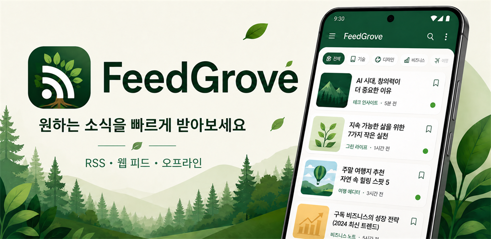
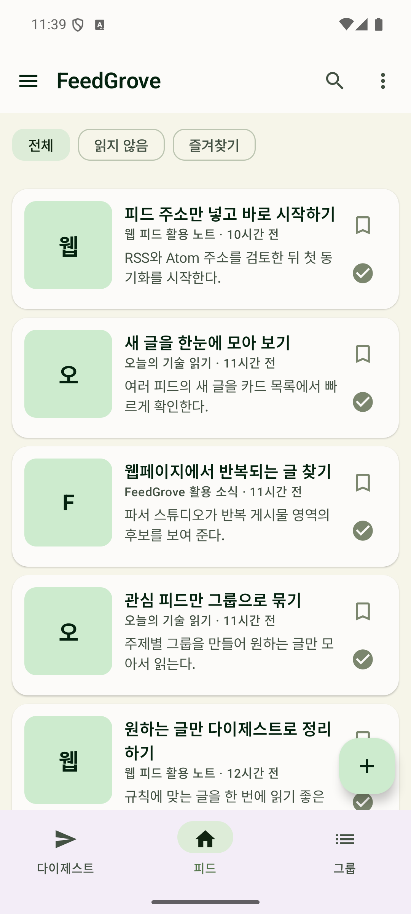
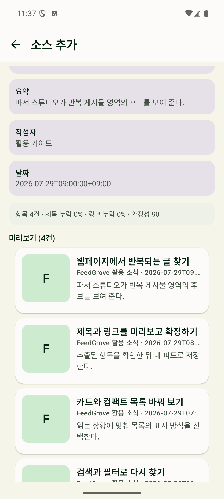
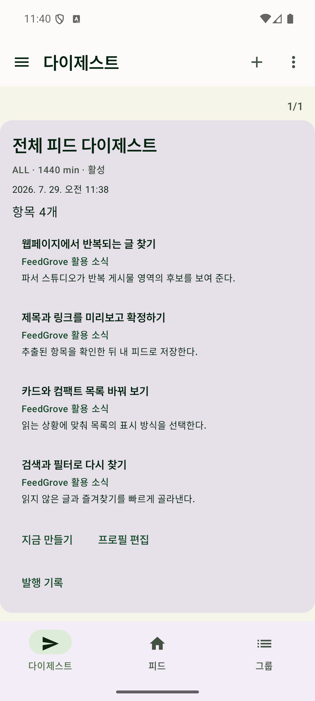

# FeedGrove

**흩어진 웹을 내 피드로 가꾸세요.**

**Bring your favorite corners of the web into one feed.**

[한국어](#한국어) | [English](#english)

## 한국어

FeedGrove는 뉴스, 블로그, 관심 있는 웹페이지의 새 글을 한곳에 모아 읽는 Android 피드 리더입니다. RSS와 Atom을 구독하고, 공식 피드가 없는 공개 웹페이지도 파서 스튜디오로 피드를 만들 수 있습니다. 계정 가입 없이 시작하고, 내 피드는 기기에서 관리합니다.

**[Google Play에서 설치하기](https://play.google.com/store/apps/details?id=com.plcmanjp.feedgrove&hl=ko)**

[앱 소개 웹사이트](https://plcmanjp.github.io/feedgrove/) | [개인정보처리방침](https://plcmanjp.github.io/feedgrove/privacy/) | [의견 보내기](https://github.com/plcmanjp/feedgrove/issues/new/choose) | [기존 이슈 보기](https://github.com/plcmanjp/feedgrove/issues)

기능 제안이나 버그 제보는 편한 언어로 작성할 수 있습니다. 이슈와 댓글은 공개되며 GitHub 계정과 로그인이 필요합니다. 내용을 확인한 뒤 직접 제출해 주세요. 개인정보, 비밀번호, 토큰, Discord 웹훅 전체 주소, 비공개 피드 주소나 민감정보를 가리지 않은 로그와 스크린샷을 포함하지 마세요. 앱 버전과 Android 버전은 선택 사항이며 제출 전에 수정하거나 지울 수 있습니다.

Android 8.0 이상에서 사용할 수 있습니다.

### 이렇게 활용하세요

| 하고 싶은 일 | FeedGrove에서 할 수 있는 일 |
|---|---|
| 여러 사이트의 새 글 모아 읽기 | RSS와 Atom 주소를 추가하거나 웹사이트 주소에서 피드 후보 찾기 |
| 관심사별로 정리하기 | 카드형 또는 컴팩트형 목록, 그룹, 검색, 읽음 표시와 즐겨찾기 |
| 피드가 없는 사이트 구독하기 | 파서 스튜디오에서 반복되는 게시물 영역을 선택하고 후보를 미리 본 뒤 확정 |
| 필요한 소식만 모아 보기 | 규칙 기반 다이제스트로 관심 있는 글 정리 |
| 내 Discord 채널로 보내기 | 직접 설정한 웹훅으로 조건에 맞는 글이나 다이제스트 전달 |

### 앱 화면

| 피드 모아 읽기 | 파서 스튜디오 | 다이제스트 |
|:---:|:---:|:---:|
|  |  |  |

### 처음 시작하기

1. Google Play에서 FeedGrove를 설치합니다.
2. 구독할 RSS, Atom 또는 웹사이트 주소를 추가합니다.
3. 검색된 피드 후보를 확인합니다. 피드가 없는 페이지는 파서 스튜디오에서 후보를 만들고 미리 본 뒤 저장합니다.
4. 새 글을 읽고 관심 있는 글을 즐겨찾기에 담습니다. 필요하면 그룹, 다이제스트와 Discord 전달을 설정합니다.

### 사용 전에 알아두세요

- 저장된 제목, 링크와 요약은 오프라인에서도 다시 볼 수 있습니다. 전체 기사 본문은 저장하지 않으며, 원문은 브라우저로 엽니다.
- 피드별 갱신 주기를 설정할 수 있지만, Android 절전 정책과 네트워크 상태에 따라 실제 갱신이 늦어질 수 있습니다.
- 공개적으로 접근 가능한 페이지를 지원합니다. 로그인, 유료벽이나 접근 제한을 우회하지 않으며, 모든 웹사이트에서 피드 생성이 가능한 것은 아닙니다.
- Discord 전달은 선택 기능입니다. 직접 설정하고 활성화하기 전에는 전송하지 않습니다.
- 배너 광고와 선택형 보상 광고가 있습니다. 광고 시청은 피드 읽기, 그룹, 다이제스트와 전달 기능의 이용 조건이 아닙니다.

설치와 업데이트는 Google Play를 이용해 주세요. 이 저장소는 FeedGrove의 공개 소개와 정책 페이지를 제공합니다.

## English

FeedGrove is an Android feed reader that brings new posts from news sites, blogs, and your favorite web pages into one place. Subscribe to RSS and Atom feeds, or use Parser Studio to create a feed from a public page without an official feed. Start without an account and manage your feeds on your device.

**[Get FeedGrove on Google Play](https://play.google.com/store/apps/details?id=com.plcmanjp.feedgrove&hl=en)**

[Product website (Korean)](https://plcmanjp.github.io/feedgrove/) | [Privacy policy](https://plcmanjp.github.io/feedgrove/privacy/) | [Send feedback](https://github.com/plcmanjp/feedgrove/issues/new/choose) | [View existing issues](https://github.com/plcmanjp/feedgrove/issues)

Suggest a feature or report a bug in any language you prefer. Issues and comments are public, and a GitHub account and sign-in are required to submit. Review and submit the form yourself. Do not include personal information, passwords, tokens, full Discord webhook URLs, private feed addresses, or unredacted logs and screenshots. App version and Android version are optional and can be edited or removed before submitting.

Requires Android 8.0 or later.

### Make it part of your reading routine

| What you want to do | How FeedGrove helps |
|---|---|
| Follow multiple sites in one place | Add RSS or Atom feeds, or discover feed candidates from a website address |
| Organize your interests | Browse card or compact lists, use groups and search, and mark posts as read or favorites |
| Follow a site without a feed | Select a repeated area in Parser Studio, preview the candidate, and confirm it |
| Catch up on relevant posts | Collect posts into rule-based digests |
| Send updates to your Discord channel | Deliver matching posts or digests through a webhook you configure |

### A look inside

Screenshots below show the Korean interface.

| Feed cards | Parser Studio | Digests |
|:---:|:---:|:---:|
|  |  |  |

### Get started

1. Install FeedGrove from Google Play.
2. Add an RSS, Atom, or website address you want to follow.
3. Review the discovered feeds. For a page without a feed, create a candidate in Parser Studio, preview it, and save it.
4. Read new posts and save favorites. Set up groups, digests, or Discord delivery whenever you need them.

### Good to know

- Saved titles, links, and summaries are available offline. Full article text is not saved; original pages open in your browser.
- You can choose a preferred refresh interval for each feed. Android power-saving rules and network conditions may delay updates.
- FeedGrove works with publicly accessible pages. It does not bypass logins, paywalls, or access restrictions, and feed creation is not supported for every website.
- Discord delivery is optional. Nothing is sent until you configure and enable it.
- The app includes banner ads and optional rewarded ads. Watching ads is not required to use feeds, groups, digests, or delivery.

Use Google Play to install and update the app. This repository provides FeedGrove's public introduction and policy pages.
